<div align="center">
  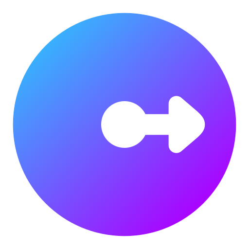
  <h1 align="center">Radius</h1>
  <p align="center">
    <strong>A proximity-first social app for nearby discovery, chat, groups, and local community interactions.</strong>
  </p>
  <p align="center">
    
    
    
    
    
  </p>
</div>

***

## 📸 App Showcase

Experience a beautifully designed, modern interface with fluid animations, intuitive navigation, and high-quality graphics. 

<div align="center">
  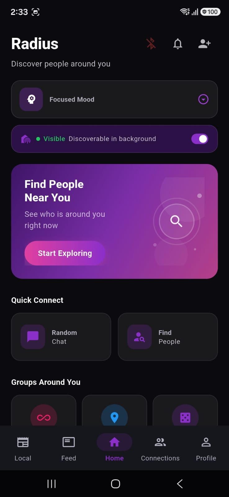
  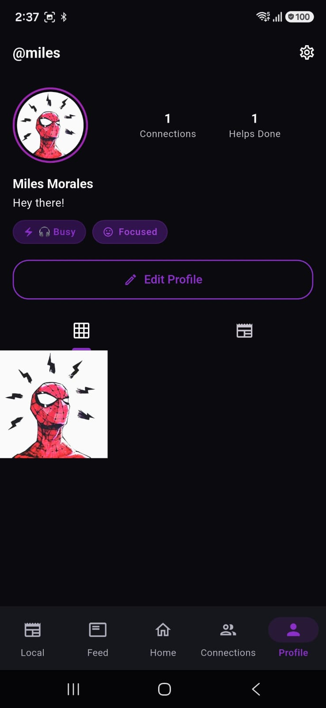
  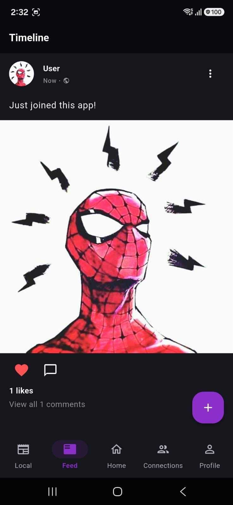
</div>
<div align="center">
  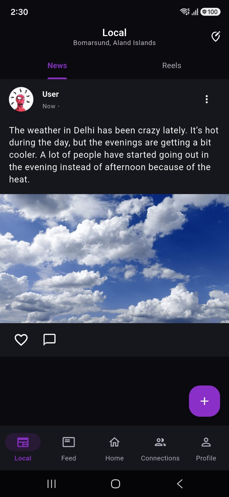
  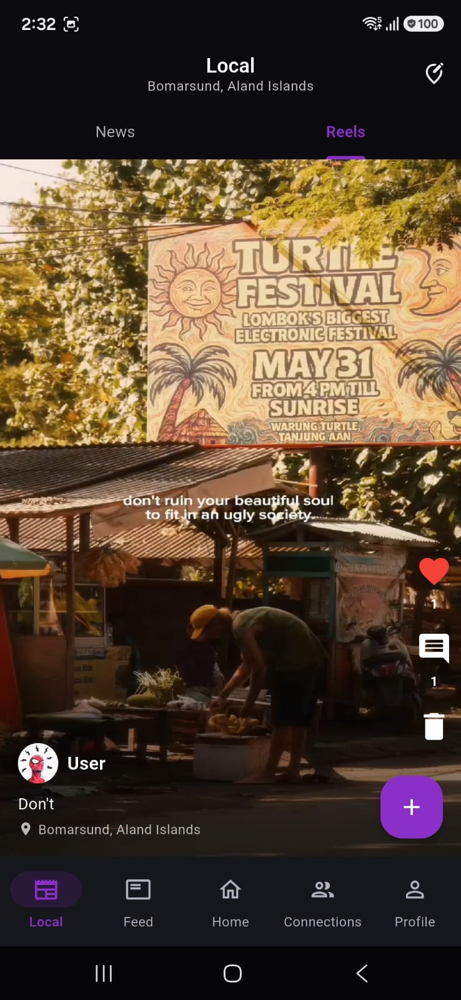
  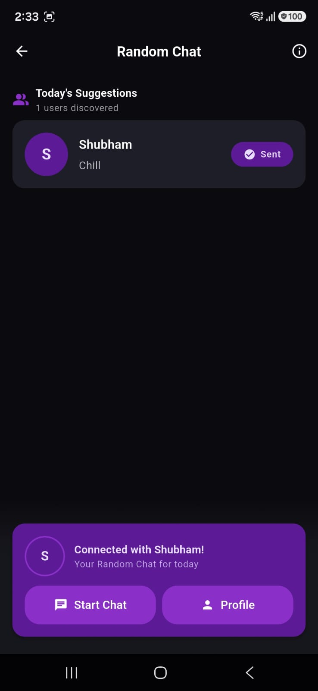
</div>
<div align="center">
  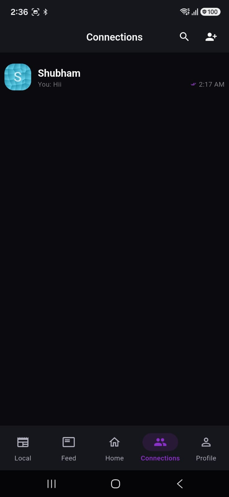
  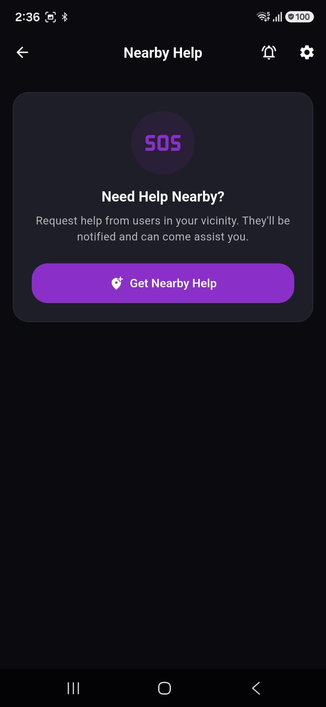
  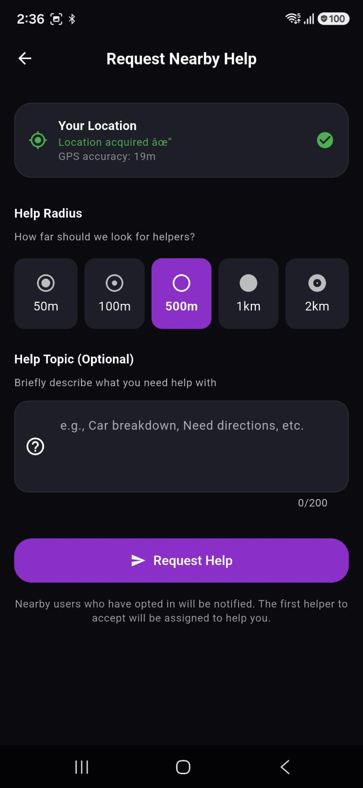
</div>
<div align="center">
  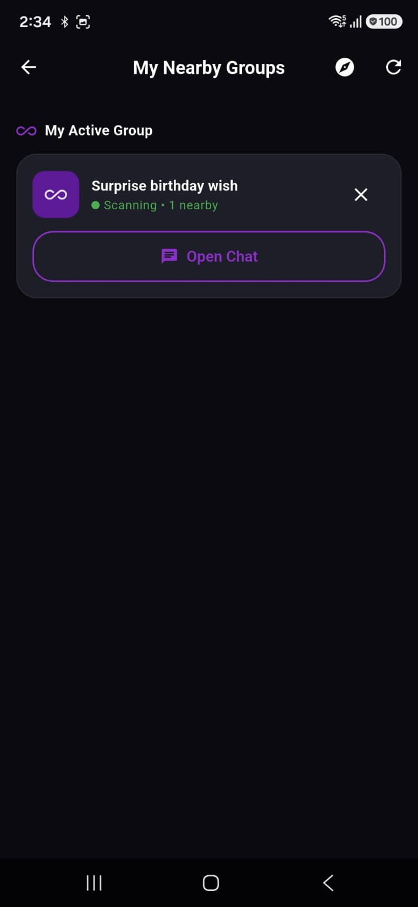
  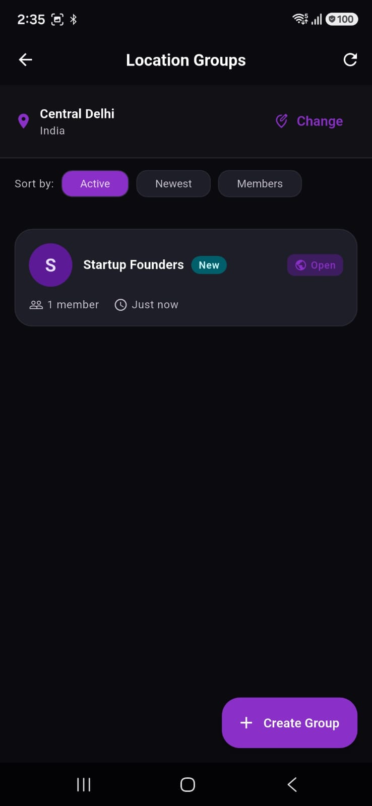
  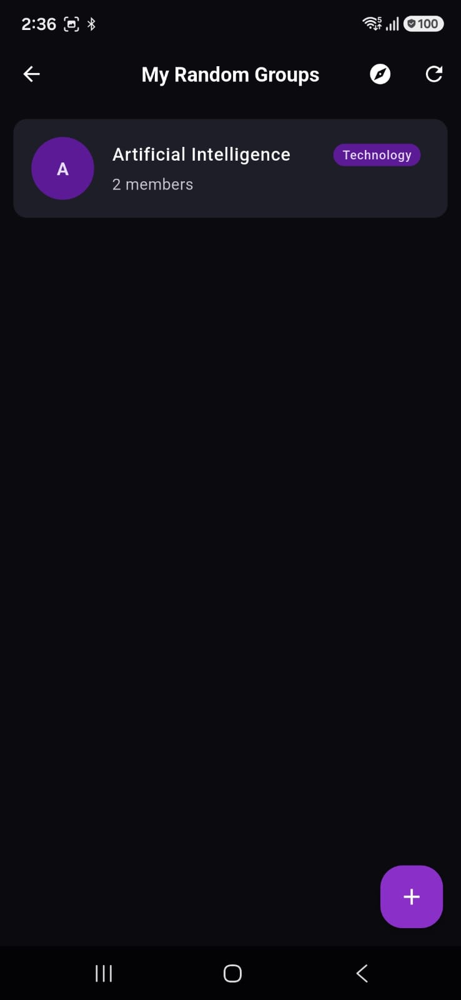
</div>

***

## ✨ What does Radius do?

Radius is built to bridge the gap between you and the people physically around you. Whether you're at a crowded cafe, attending a university, or just chilling in your neighborhood, Radius uses **Bluetooth Low Energy (BLE)** and **Geolocation** to help you discover and interact with your immediate surroundings.

### 🌟 Key Features

*   **📍 Proximity-Based Discovery (BLE):** Discover users who are physically near you in real-time, even in the background! Say goodbye to swiping on people miles away—connect with the person sitting across the room.
*   **🤝 Connections & Profiles:** Send connection requests, build your social circle, and manage a highly customizable social profile.
*   **💬 Real-Time Chat (Stream Chat):** Lightning-fast 1:1 and Group messaging. 
    *   *Rich Media Support:* Send high-quality images, voice notes, videos, and documents.
    *   *Real-time Typing Indicators, Read Receipts, and Presence.*
*   **🎲 Random Chat:** Feeling spontaneous? Jump into an anonymous, location-aware random chat to talk with someone nearby instantly.
*   **📰 Local News Feed / Posts:** A hyper-local feed. Post updates, photos, or announcements to everyone in your current radius.
*   **🆘 Nearby Help Requests (SOS / Nav):** Need assistance? Send out a local beacon. Nearby users will get push notifications and can use live **Google/Apple Maps** routing to navigate directly to your location.
*   **🎨 Premium UI / UX:** Fully responsive, beautiful Glassmorphism elements, modern topography, dark/light themes, and buttery smooth micro-animations.

***

## 🛠 Tech Stack & Architecture

Radius is engineered for scale and speed, utilizing a modern, reactive stack.

### Frontend (Mobile App)
*   **Framework:** Flutter (Dart)
*   **State Management:** BLoC / Cubit (`flutter_bloc`)
*   **Dependency Injection:** `get_it` & `injectable`
*   **Navigation:** `go_router` for deep linking and declarative routing
*   **Local Storage:** Hive (NoSQL for offline caching)

### Backend (BaaS & Custom Backend)
*   **Auth:** Firebase Authentication (Google, Email/Password)
*   **Database:** Cloud Firestore (Real-time NoSQL) & Firebase Realtime Database
*   **Storage:** Firebase Cloud Storage
*   **Messaging:** Stream Chat (Enterprise-grade Chat API) & Firebase Cloud Messaging (FCM)
*   **Custom API:** Node.js + Express backend (deployed via Render) for Stream token generation and secure operations.

***

## 🚀 Developer Setup

### Prerequisites
- Flutter SDK (>=3.2.0)
- Node.js (v22+)
- Firebase CLI (`npm install -g firebase-tools`)

### 1️⃣ Clone & Install Dependencies
```bash
flutter pub get
```

### 2️⃣ Configure Firebase
- Add `android/app/google-services.json`
- Add `ios/Runner/GoogleService-Info.plist`
- Ensure `lib/firebase_options.dart` matches your Firebase project (via FlutterFire CLI).

### 3️⃣ Configure Backend (.env)
Create a `.env` file in the `backend/` directory or in `lib/core/constants/` with your backend URLs and API Keys for Stream chat.
```bash
BACKEND_URL=https://radius-backend-zr84.onrender.com/api
```

### 4️⃣ Run the App
```bash
# Run in dev environment
flutter run --dart-define=RADIUS_ENV=dev
```

***

## 📱 Build for Production

### Android
```bash
flutter build apk --release
flutter build appbundle --release
```

### iOS (Requires macOS)
```bash
flutter build ios --release
flutter build ipa --release
```

***

## 📚 Useful Documentation

For detailed configurations, check out our docs:
- [Quick Reference](docs/QUICK_REFERENCE.md)
- [Notification Setup](docs/NOTIFICATION_SETUP.md)
- [Firebase Storage Setup](docs/FIREBASE_STORAGE_SETUP.md)
- [Chat Media Features](docs/CHAT_MEDIA_FEATURES.md)

## 📜 License

This project is licensed under the [MIT License](LICENSE).

---
<div align="center">
  <i>Built by CodeShowOff</i>
</div>
